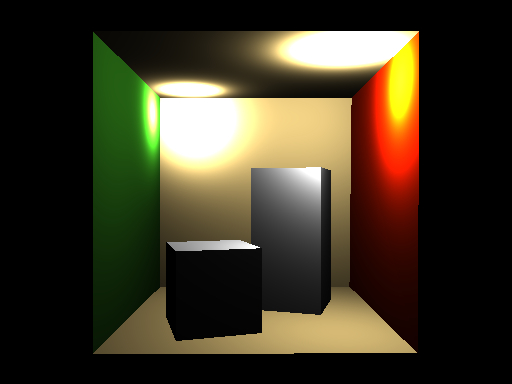

# Underwater Caustics Renderer

## Description

This C++ program renders a scene with underwater caustics and global illumination from $>=1$ light sources.  
Photon mapping (the light transport model used) creates sharp, focused patterns resulting from the refraction of photons across the air-water boundary.

The water surface is generated from rasterized **FFT-based triangle meshes**. A **Kd-tree** data structure accelerates ray tracing and makes radiance estimation for the "photon spheres" efficient.

### Real-world underwater caustics (what we're trying to reproduce)

  
   
  <em>Two photon mapped light sources cast on the Cornell box</em>

  
   
  <em>Rendered underwater scene with realistic caustics and refractions</em>

## Input / Output

### Input
- A scene in `.obj` format
- Materials defined in a companion `.mtl` file

### Output
- Final rendered image saved as `.png`

## Compilation & Running

- Open the project in **VS Code**
- Compile using the **Build** task (bottom bar)
- Run with **Shift + F5** (or via debugger)

## Features / Techniques Used
- Photon mapping for caustics and global illumination
- FFT-based water surface mesh generation
- Kd-tree acceleration structure
- Refraction & Fresnel effects at air-water interface
